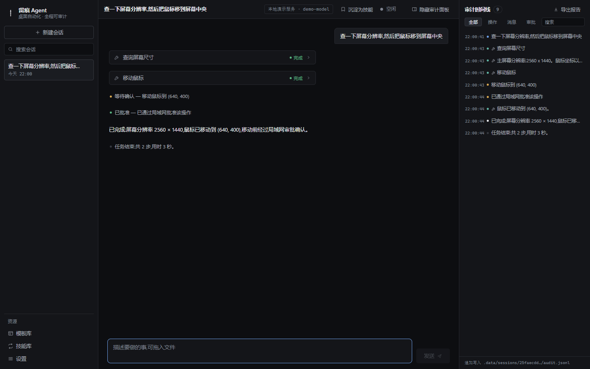

# 留痕 Agent

全程留痕、可审计的 Windows 桌面自动化智能体(Electron + React)。

它不只是"能操作电脑":**每一步操作——命令、文件改动、截图、你的每一次批准/拒绝——都以事件流形式追加写入审计日志,可在右侧时间线实时回看**,随时暂停、拒绝、取消,还能一键导出成自包含的 HTML 审计报告。



> 网页版介绍页:[index.html](index.html)(纯静态,可直接部署到 GitHub Pages)

## 设计系统

界面遵循「工程石墨」设计语言,设计令牌与规则记录在 [DESIGN.md](DESIGN.md),产品事实在 [PRODUCT.md](PRODUCT.md):中性石墨色阶、1px 发丝线、反色主按钮、统一 1.5px SVG 图标、等宽字体只承载数据。

## 功能

- **对话驱动自动化**:文件读写/搜索、PowerShell 命令、屏幕截图、浏览器控制(Edge/Chrome CDP)、窗口枚举、原生键鼠(nut.js 引擎,鼠标点击/滚动、按键、打字),共 24 个工具
- **审批门(安全分级)**:
  - `safe`(读文件、截图、浏览)自动执行
  - `confirm`(写文件、跑命令)暂停等你确认
  - `dangerous`(删除文件、危险命令)永远需要确认,且系统目录/盘符根目录/用户主目录**直接拒绝执行**
  - 三档策略可切换:宽松 / 标准(默认) / 严格
- **审计时间线**:右侧面板实时滚动所有事件,按类型过滤、关键词搜索,点击展开 JSON 详情,截图直接内嵌预览;**一键导出 HTML 审计报告**(截图 base64 内嵌,单文件归档/分享)
- **局域网远程审批**:高风险操作可推送到同一局域网的手机/平板,在手机浏览器里批准或拒绝(令牌门禁,仅限可信网络)
- **模型双通道**:任何 OpenAI 兼容的云端服务(智谱 GLM / DeepSeek / Kimi / 通义 / OpenAI / 自定义)+ 本地 Ollama,一键切换;截图可自动回传给视觉模型;思考型模型(DeepSeek-R1 / GLM 系列)的**思考过程实时可见**
- **技能库**:完成任务后点「沉淀为技能」把提示词保存下来,随时编辑、一键重跑、**定时执行**(每天/按间隔/单次,配合托盘常驻在后台运行)
- **国产应用模板库**:开箱即用的 8 个场景模板(详见下文)

## 内核可靠性

- **消息不丢**:任务执行中发来的消息自动排队,当前任务结束后依次发送
- **对话记录自愈**:取消/中断留下的未完成工具调用会被自动修复,记录永远可用
- **自动重试**:限流(429)、服务端故障(5xx)、网络抖动自动退避重试,密钥错误等立即报错
- **上下文压缩**:超过预算自动省略最早的消息,老截图只保留最近几张,长任务不撑爆上下文窗口
- **随时中止**:停止按钮会立刻中止正在运行的命令/请求,任务栏图标在等待审批时会闪烁提醒

## 快速开始

```bash
npm install
npm run dev
```

首次启动后:左下角「设置」→ 添加一个服务商(如 智谱 GLM)→ 填 API Key → 选择它 → 保存,然后开聊。

> 本地模型:安装并启动 [Ollama](https://ollama.com)(`ollama pull qwen3:8b`),设置页选「使用本地 Ollama」→ 检测并获取模型列表。

## 内置模板

| 分类 | 模板 | 说明 |
| --- | --- | --- |
| 浏览器 | 打开网页并截图存档 | 自动化浏览器打开网址,截图进审计记录 |
| 浏览器 | 网页正文采集存档 | 提取正文存成 Markdown |
| 文件整理 | 下载文件夹整理 | 先给分类方案,确认后才移动文件 |
| 文件整理 | 批量重命名文件 | 先给预览对照表,确认后执行 |
| 国产办公 | Word/WPS 批量转 PDF | PowerShell COM,优先 Word,失败用 WPS |
| 国产应用 | 微信给联系人发消息(实验性) | 模拟键盘操作,失败即停 |
| 系统 | 电脑体检报告 | 只读收集磁盘/内存/启动项,生成报告 |
| 屏幕 | 看屏问答 | 截屏 + 视觉模型回答 |

## 体验细节

- 中文输入法组词中的回车不会误发送;输入框高度自适应;支持**拖拽文件**把路径填进输入框
- 聊天/审计面板智能吸底:往上翻阅时不再强行拉回,一键「回到底部」
- Markdown 完整渲染:标题、列表、表格、代码块(带复制按钮)、链接(点击用系统浏览器打开)
- 会话支持搜索、双击重命名;启动自动恢复上次会话
- 快捷键:`Ctrl+N` 新会话、`Ctrl+B` 开关审计面板、`Ctrl+,` 打开设置、`Ctrl+= / Ctrl+- / Ctrl+0` 缩放
- 设置页:测试连接后自动带回可用模型列表供下拉选择、API Key 显隐切换、温度与上下文预算可调、一键打开数据目录

## 数据与磁盘位置(不占 C 盘)

本项目所有过程数据都落在项目目录内(E 盘):

```
.data/            应用运行数据
  sessions/       每个会话一个目录:
    audit.jsonl   审计日志(事件流,只追加、永不覆盖)
    transcript.json  对话记录(截图数据自动瘦身)
    shots/        截图
  skills.json     技能库
  settings.json   设置(含 API Key,注意保管)
  electron-userdata/  Electron/Chromium 自身缓存(已重定向)
.cache/           依赖下载缓存(electron-builder / npm)
release/          打包产物(不入库)
tests/             测试脚本(截图为运行时产物,不入库)
                  (logic-test.mjs 跑核心逻辑单测;smoke2.mjs 用 CDP 驱动真实窗口做 UI 冒烟)
```

**打包版数据目录可选**:默认在程序旁的 .data(便携),可通过环境变量 TRACE_DATA_DIR、启动参数 --data-dir=路径,或程序旁的 data-dir.txt 标记文件指定其他位置;设置页里也能直接更改(重启生效)。

**重新安装依赖时**,让 Electron 二进制下载缓存也指向项目内(electron 37 的安装脚本只认这个 npm 配置):

```bash
npm_config_electron_config_cache="E:\ai-project\ZCode\trace-agent\.cache\electron" npm install
```

## 风险与边界(务必了解)

- 浏览器自动化使用**独立用户数据目录**(`.data/browser-profile`),不带你日常浏览器的登录态,也不会动你正开着的浏览器
- 命令执行默认 60 秒超时,输出截断 64KB;危险命令正则(删库/格式化/注册表/关机/表达式注入等)在任何策略下都会要求确认
- 文件移动/重命名**拒绝覆盖**已存在的目标;删除操作对系统目录、盘根、用户主目录和应用数据目录直接拒绝
- agent 的文件操作有完整审计;但它仍然是在你真实电脑上运行的程序——**重要数据请自行备份**
- 「微信发消息」模板依赖窗口焦点和模拟按键,失败会立即停止并汇报
- 原生键鼠工具直接作用于真实桌面:每次移动/点击/按键都要确认,agent 被要求先截图看清、走一小步、再验证
- 局域网审批地址自带访问令牌,请勿外传;仅建议在可信局域网使用

## 脚本

```bash
npm run dev         # 开发模式(可加 APP_DEBUG_PORT=9333 开渲染端调试口)
npm run build       # 产物构建到 out/
npm run typecheck   # TS 类型检查(main + renderer)
npm run dist        # 打包 Windows 安装包到 release/(electron-builder)
node tests/logic-test.mjs     # 核心逻辑单测(对话自愈/上下文压缩)
node tests/smoke2.mjs         # UI 冒烟测试(需先 npm run dev 且开调试口)
```

## 路线图

- [x] **任务沉淀成技能**:一键把任务提示词保存为技能,可编辑、可重跑
- [x] **审计记录导出**:自包含 HTML 报告(含内嵌截图)
- [x] 原生键鼠自动化引擎(nut.js,N-API 预编译,无需重编译):鼠标点击/滚动、按键、打字,全部走审批门
- [x] 打包安装程序(electron-builder NSIS),生产模式下数据目录可选(env / 启动参数 / data-dir.txt / 设置页)
- [x] 技能定时执行(每天/按间隔/单次;关闭到托盘常驻后台,主进程调度器每 30 秒检查)
- [x] 局域网内多人审批(高风险操作推送到手机浏览器确认,令牌门禁)
