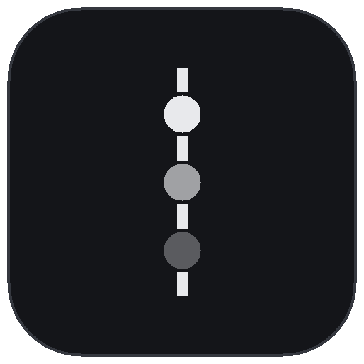

<div align="center">
  
  <h1>留痕 Agent</h1>
  <p><b>替你操作电脑,每一步都留痕。</b></p>
  <p>
    <a href="#-快速开始">快速开始</a> ·
    <a href="index.html">网页版介绍</a> ·
    <a href="#-工具一览">工具一览</a> ·
    <a href="#-风险与边界">风险与边界</a> ·
    <a href="https://github.com/FANG050829/trace-agent/issues">反馈问题</a>
  </p>
</div>

---

留痕 Agent 是运行在你 Windows 电脑上的桌面自动化智能体(Electron + React):它替你操作文件、跑命令、截屏、控制浏览器、动键鼠——**它做过的每一件事,都以事件流的形式追加写入审计日志,可在右侧时间线实时回看**,随时批准、拒绝、取消,还能一键导出成自包含的 HTML 审计报告。

你亲眼核对它做过的每一件事,而不是相信它。


## ✦ 它能做什么

### 对话驱动自动化 · 24 个工具

| 领域 | 工具 |
| --- | --- |
| 文件 | 列目录 / 读文件(自动识别 UTF-8/GBK)/ 写文件 / 建目录 / 移动重命名(拒绝覆盖)/ 删除(系统路径硬拒绝)/ 全盘搜索 |
| 命令 | PowerShell(UTF-8 输出、60s 超时、危险命令识别、**取消即中止**) |
| 屏幕 | 截屏(可回传视觉模型) |
| 浏览器 | 独立实例启动 / 打开网页 / 提取正文 / 点击 / 输入 / 按键 / 截图 / 关闭 |
| 桌面 | 原生键鼠(nut.js 引擎):鼠标移动 / 点击 / 滚动、组合按键、文字键入 |
| 系统 | 窗口枚举 |

### 审批门:该自动的自动,该问的必问

- **safe**(读文件、截屏、浏览)自动执行;**confirm**(写文件、跑命令、动键鼠)暂停等你批准;**dangerous**(删除、格式化)永远确认,且**系统目录 / 盘符根目录 / 用户主目录**在任何策略下直接拒绝
- 三档策略:宽松 / 标准(默认)/ 严格;等待批准时任务栏图标闪烁
- **局域网远程审批**:高风险操作可推送到同一局域网的手机 / 平板,在令牌门禁的审批页里看清参数原文,一键批准或拒绝——决定同样写入审计

### 审计时间线:发生过的事,查得到,带得走

- 实时滚动、按类型过滤、关键词搜索、点击展开原始 JSON、截图内嵌预览
- 一键**导出自包含 HTML 审计报告**(截图 base64 内嵌,单文件归档 / 分享,与界面同一视觉血统)

### 技能库:任务沉淀成技能,还能定时跑

- 任务完成后点「沉淀为技能」,提示词存下来,随时编辑、一键重跑(自动开新会话)
- **定时执行**:每天定时 / 按间隔重复 / 只跑一次;开启「关闭到托盘」后应用常驻后台,到点自动执行并发系统通知

### 模型双通道 + 内核可靠性

- 任何 OpenAI 兼容云端(智谱 GLM / DeepSeek / Kimi / 通义 / OpenAI / 自定义)+ 本地 Ollama;截图自动回传视觉模型;思考型模型(DeepSeek-R1 / GLM 系列)的思考过程实时可见
- 消息不丢(执行中发送自动排队)· 对话记录自愈(取消 / 中断不留损坏)· 限流 / 5xx / 网络抖动自动退避重试 · 上下文超预算自动压缩(老截图只留最近几张)· 随时中止

## ⚡ 快速开始

```powershell
git clone https://github.com/FANG050829/trace-agent.git
cd trace-agent
npm install
npm run dev
```

1. 启动后左下角打开「**设置**」,添加服务商(智谱 GLM / DeepSeek / Kimi / 通义 / OpenAI 或本地 Ollama),填 API Key,测试连接后选择它
2. 回到对话页开聊——右侧审计时间线从第一句话开始留痕

> **不想装环境?** `npm run dist` 打出 Windows 安装包(NSIS),装完即用;打包版数据目录默认在程序旁,可通过环境变量 `TRACE_DATA_DIR`、启动参数 `--data-dir=路径` 或程序旁的 `data-dir.txt` 标记文件改到任意位置(设置页里也能直接更改,重启生效)。
>
> **本地模型**:安装并启动 [Ollama](https://ollama.com)(`ollama pull qwen3:8b`),设置页选「使用本地 Ollama」。

## 📋 内置模板

| 分类 | 模板 | 说明 |
| --- | --- | --- |
| 浏览器 | 打开网页并截图存档 | 自动化浏览器打开网址,截图进审计记录 |
| 浏览器 | 网页正文采集存档 | 提取正文,存成 Markdown |
| 文件整理 | 下载文件夹整理 | 先给分类方案,确认后才移动文件 |
| 文件整理 | 批量重命名文件 | 先给预览对照表,确认后执行 |
| 国产办公 | Word/WPS 批量转 PDF | PowerShell COM,优先 Word,失败用 WPS |
| 国产应用 | 微信给联系人发消息(实验性) | 模拟键盘操作,失败即停 |
| 系统 | 电脑体检报告 | 只读收集磁盘 / 内存 / 启动项,生成报告 |
| 屏幕 | 看屏问答 | 截屏,视觉模型回答 |

## ✨ 体验细节

- 中文输入法组词中的回车不会误发送;输入框高度自适应;**拖拽文件**自动填路径
- 聊天 / 审计智能吸底(上翻不打扰)+ 回到底部按钮;Markdown 完整渲染(表格、代码块复制、链接外部打开)
- 会话搜索、双击重命名;启动自动恢复上次会话;渲染端崩溃有兜底页
- 快捷键:`Ctrl+N` 新会话 · `Ctrl+B` 审计面板 · `Ctrl+,` 设置 · `Ctrl+= / - / 0` 缩放
- 设置页:测试连接带回可用模型列表、API Key 显隐、温度与上下文预算、一键打开数据目录

## 🎨 设计系统

界面遵循「**工程石墨**」设计语言:中性石墨色阶 + 墨白文字 + 1px 发丝线 + 反色主按钮,统一 1.5px SVG 图标,零 emoji、零发光。设计令牌与规则记录在 [DESIGN.md](DESIGN.md),产品事实在 [PRODUCT.md](PRODUCT.md),纯静态介绍页在 [index.html](index.html)(可直接部署 GitHub Pages)。

## 📁 数据与磁盘位置

所有过程数据都落在项目目录内(E 盘),不占 C 盘:

```
.data/            应用运行数据
  sessions/       每个会话一个目录:audit.jsonl(审计流)+ transcript.json + shots/
  skills.json     技能库
  settings.json   设置(含 API Key,注意保管)
  electron-userdata/  Electron 自身缓存(已重定向)
.cache/           依赖下载缓存(electron-builder / npm)
release/          打包产物(不入库)
tests/            测试脚本(逻辑单测 + CDP 冒烟 + 假模型端到端)
```

**重装依赖时**让 Electron 二进制缓存也指向项目内:

```bash
npm_config_electron_config_cache="E:\ai-project\ZCode\trace-agent\.cache\electron" npm install
```

## ⚠️ 风险与边界

- 它运行在你的**真实系统**上,文件操作有完整审计;但请**自行备份重要数据**
- 浏览器自动化使用**独立用户数据目录**,不带你日常登录态,不碰你正开着的浏览器
- 原生键鼠直接作用于真实桌面:每次移动 / 点击 / 按键**先经你确认**;agent 被要求先截图、走一小步、再验证
- 命令默认 60s 超时、输出截断 64KB;文件移动 / 重命名**拒绝覆盖**已有目标
- 局域网审批地址自带访问令牌,请勿外传,仅限可信网络;「微信发消息」模板失败即停,不会硬试到底

## 🧰 脚本

| 命令 | 说明 |
| --- | --- |
| `npm run dev` | 开发模式(`APP_DEBUG_PORT=9333` 开调试口) |
| `npm run build` | 构建到 `out/` |
| `npm run typecheck` | TS 类型检查(main + renderer) |
| `npm run dist` | 打包 Windows 安装包到 `release/` |
| `node tests/logic-test.mjs` | 核心逻辑单测(对话自愈 / 上下文压缩) |
| `node tests/smoke2.mjs` | UI 冒烟(需先 `npm run dev` 开调试口) |
| `node tests/fake-llm2.mjs` | 本地假模型,端到端验收键鼠 / 审批 / 定时链路 |

---

<div align="center">
  <br>
  <b>留痕 Agent</b>
  <p>Copyright © 2026 <b>youxi</b> · 以 <a href="LICENSE">MIT License</a> 开源发布<br>
  本项目由人工与智能体协作构建——每一次提交,同样有迹可循。</p>
</div>

